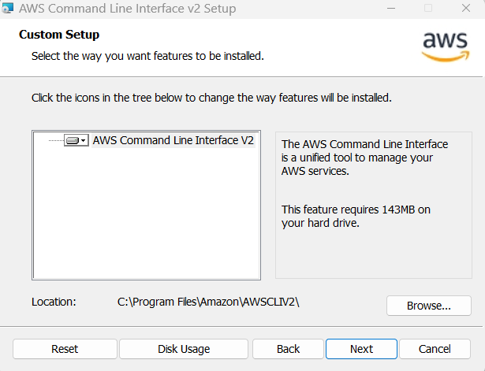
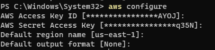
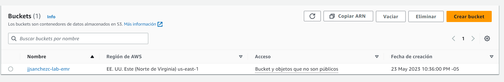
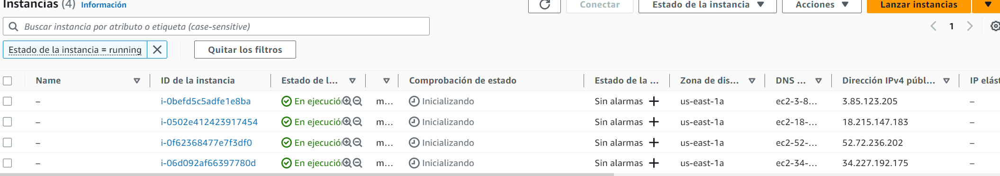
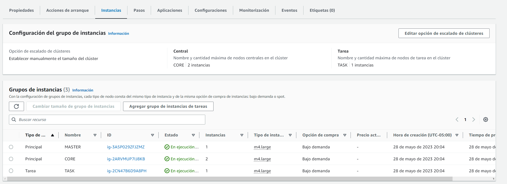

# Laboratorio: Map/Reduce en Python con MRJOB

## menu de siempre


***
## Descargar el CLI
- Primero se descarga el CLI desde la pagina de AWS 



- Despues se configura el aws 



## Crear un S3
- Existen 2 formas de hacerlo la pagina de AWS o el CLI

### AWS



### CLI
Para este lab se creó un s3 llamado lab-jjsanchezc-emr
```
aws s3 mb s3://lab-jjsanchezc-emr
```
***
si queremos ver que se creó correctamente podemos usar el comando 
```
aws s3 ls
```
o podemos verlo en aws como 


## Key Pairs
- Para los pares de clave se utilizará la llave creada en el lab anterior, la cual se llama `"emr-key.pem"`

## Creación del ClusterEMR
Para la creación del cluster se tuvo que hacer el siguente comando:
```
aws emr create-cluster \
    --release-label emr-5.26.0 \
    --service-role EMR_DefaultRole \
    --ec2-attributes InstanceProfile=EMR_EC2_DefaultRole \
    --name emr-lab-reto-cluster \
    --applications Name=Hue Name=Spark Name=Hadoop Name=Sqoop Name=Hive \
    --instance-groups InstanceGroupType=MASTER,InstanceCount=1,InstanceType=m4.large InstanceGroupType=CORE,InstanceCount=2,InstanceType=m4.large InstanceGroupType=TASK,InstanceCount=1,InstanceType=m4.large \
    --no-auto-terminate
```
`--release-label` Especifica la versión de lanzamiento de Amazon EMR <br>
`--service-role` Especifica el rol de servicio de IAM <br>
`--ec2-attributes`Configuraciones de instancias de clúster y Amazon EC2.<br>
`--name` Nombre del cluster <br>
`--applications` Aplicaciónes que se van a instalar en el cluster <br>
`--instance-group` Especifica el numero y el tipo de instancias EC2 que se van a crear, aparte del rol que estas van a tomar, sea "MASTER", "CORE" ó "TASK" <br>

### Resultados 
- ### EC2



- ### EMR




***

## Referencias 
https://docs.aws.amazon.com/cli/latest/reference/emr/create-cluster.html
PDF-Laboratorio-N6-Crear Cluster EMR-Hadoop
https://docs.aws.amazon.com/es_es/cli/latest/userguide/cli-services-s3-commands.html
