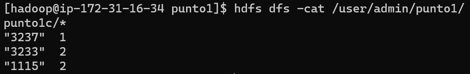
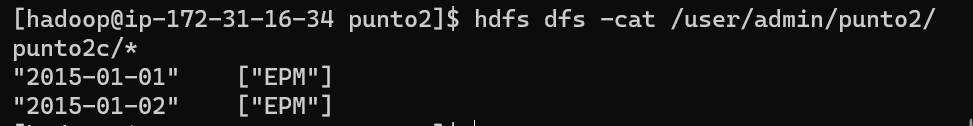
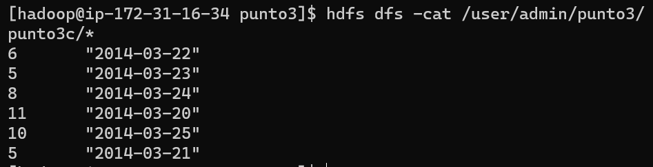
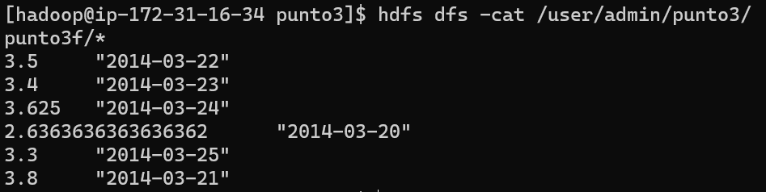

# Laboratorio / Reto: Map/Reduce en Python con MRJOB

## menu de siempre


***
## 1. Creación ClusterEMR con CLI
## Descargar el CLI
- Primero se descarga el CLI desde la pagina de AWS 


- Despues se configura el aws 


## Crear un S3
- Existen 2 formas de hacerlo la pagina de AWS o el CLI

### AWS


### CLI
Para este lab se creó un s3 llamado lab-jjsanchezc-emr
```
aws s3 mb s3://lab-jjsanchezc-emr
```
***
si queremos ver que se creó correctamente podemos usar el comando 
```
aws s3 ls
```
o podemos verlo en aws como 


## Key Pairs
- Para los pares de clave se utilizará la llave creada en el lab anterior, la cual se llama `"emr-key.pem"`

## Creación del ClusterEMR
Para la creación del cluster se tuvo que hacer el siguente comando:
```
aws emr create-cluster \
    --release-label emr-6.10.0 \
    --service-role EMR_DefaultRole \
    --ec2-attributes KeyName=emr-key,InstanceProfile=EMR_EC2_DefaultRole \
    --name emr-lab-reto-cluster \
    --applications Name=Hue Name=Spark Name=Hadoop Name=Sqoop Name=Hive \
    --instance-groups InstanceGroupType=MASTER,InstanceCount=1,InstanceType=m4.large InstanceGroupType=CORE,InstanceCount=2,InstanceType=m4.large InstanceGroupType=TASK,InstanceCount=1,InstanceType=m4.large \
    --no-auto-terminate
```
`--release-label` Especifica la versión de lanzamiento de Amazon EMR <br>
`--service-role` Especifica el rol de servicio de IAM <br>
`--ec2-attributes`Configuraciones de instancias de clúster y Amazon EC2.<br>
`--name` Nombre del cluster <br>
`--applications` Aplicaciónes que se van a instalar en el cluster  `no se si ponerlo`<br>
`--instance-group` Especifica el numero y el tipo de instancias EC2 que se van a crear, aparte del rol que estas van a tomar, sea "MASTER", "CORE" ó "TASK" <br>

### Resultados 
- ### EC2


- ### EMR


***
# 2.Conexión Main node del cluster

## conexión

para la conexion por SSH debemos usar la `"emr-key.pem"`:

cuando estemos dentro actualizaremos yum, instalamos pip, mrjob y luego git:

```
sudo yum update -y
sudo yum install git -y
sudo yum install python-pip -y
sudo pip3 install mrjob
```

se hace la copia del repo:

```
git clone https://github.com/ST0263/st0263-2023-1.git
```

Luego de haber clonado el repo se entra en el y se realizan los siguientes comandos: 

```
cd st0263-2023-1/
cd "Laboratorio N6-MapReduce"
cd wordcount
python wordcount-local.py ../../datasets/gutenberg-small/*.txt > salida-serial.txt
```
si se hace el `sudo nano salida-serial.txt` veremos como se creó el archivo "salida-serial.txt" 
este es el resultado:


<br>

Ahora se quiere probar el mrjob local y se hace con el siguiente comando

```
python wordcount-mr.py ../../datasets/gutenberg-small/*.txt
```

Al final se quiere usar 
```
python "wordcount-mr.py -r hadoop hdfs:///datasets/gutenberg-small/*.txt --output-dir hdfs:///user/<login>/result3 --hadoop-streaming-jar $HADOOP_STREAMING_HOME/hadoop-streaming.jar
```
Y sus resultados deberian ser:


***

# Reto de programación en Map/Reduce

Debido a que en estos retos nos pedían que estos se resolvieran en el EMR, debemos clonar este repo

```
git clone https://github.com/jjsanchezc/TopicosEnTelematica.git
cd Laboratorios/Lab6/RetoProgramacion
```
Luego de entrar al `RetoProgramacion` podemos ver que está separado en cada punto que se pedia, y dentro de estos puntos se encuentran sus respectivas datasets.txt

## Punto1

Se tiene un conjunto de datos, que representan el salario anual de los empleados formales en Colombia por sector económico, según la DIAN. ver su [dataset.txt](RetoProgramacion/punto1/dataset.txt) <br>

### Punto1a
El salario promedio por Sector Económico (SE) <br>
si desea ver el [codigo](RetoProgramacion/punto1/punto1a.py) <br>
se ejecuta el comando:

```
python punto1/punto1a.py dataset.txt
```

y su resultado es:


***

### Punto1b
El salario promedio por Empleado <br>
si desea ver el [codigo](RetoProgramacion/punto1/punto1b.py) <br>
se ejecuta el comando:

```
python punto1/punto1b.py dataset.txt
```

y su resultado es:


***

### Punto1c
Número de SE por Empleado que ha tenido a lo largo de la estadística <br>
si desea ver el [codigo](RetoProgramacion/punto1/punto1c.py) <br>
se ejecuta el comando:

```
python punto1/punto1c.py dataset.txt
```

y su resultado es:



***

# Punto2

Se tiene un conjunto de acciones de la bolsa, en la cual se reporta a diario el valor promedio por acción, la estructura de los datos es [dataset.txt](RetoProgramacion/punto2/dataset.txt) <br>

### Punto2a
Por acción, dia-menor-valor, día-mayor-valor <br>
si desea ver el [codigo](RetoProgramacion/punto2/punto2a.py) <br>
se ejecuta el comando:

```
python punto2/punto2a.py dataset.txt
```

y su resultado es:


***

### Punto2b
Listado de acciones que siempre han subido o se mantienen estables <br>
si desea ver el [codigo](RetoProgramacion/punto2/punto2b.py) <br>
se ejecuta el comando:

```
python punto2/punto2b.py dataset.txt
```

y su resultado es:


***

### Punto2c
DIA NEGRO: Saque el día en el que la mayor cantidad de acciones tienen el menor valor de acción (DESPLOME), suponga una inflación independiente del tiempo. <br>
si desea ver el [codigo](RetoProgramacion/punto2/punto2c.py) <br>
se ejecuta el comando:

```
python punto2/punto2c.py dataset.txt
```

y su resultado es:



***

# Punto3
Sistema de evaluación de películas: Se tiene un conjunto de datos en el cual se evalúan las películas con un rating. Ver su [dataset.txt](RetoProgramacion/punto3/dataset.txt) <br>

### Punto3a
Número de películas vista por un usuario, valor promedio de calificación (SE) <br>
si desea ver el [codigo](RetoProgramacion/punto3/punto3a.py) <br>
se ejecuta el comando:

```
python punto3/punto3a.py dataset.txt
```

y su resultado es:


***

### Punto3b
Día en que más películas se han visto <br>
si desea ver el [codigo](RetoProgramacion/punto3/punto3b.py) <br>
se ejecuta el comando:

```
python punto3/punto3b.py dataset.txt
```

y su resultado es:


***

### Punto3c
Día en que menos películas se han visto <br>
si desea ver el [codigo](RetoProgramacion/punto3/punto3c.py) <br>
se ejecuta el comando:

```
python punto3/punto3c.py dataset.txt
```

y su resultado es:



***

### Punto3d
Número de usuarios que ven una misma película y el rating promedio <br>
si desea ver el [codigo](RetoProgramacion/punto3/punto3d.py) <br>
se ejecuta el comando:

```
python punto3/punto3d.py dataset.txt
```

y su resultado es:


***

### Punto3e
Día en que más películas se han visto <br>
si desea ver el [codigo](RetoProgramacion/punto3/punto3e.py) <br>
se ejecuta el comando:

```
python punto3/punto3e.py dataset.txt
```

y su resultado es:


***

### Punto3f
Número de películas vista por un usuario, valor promedio de calificación (SE) <br>
si desea ver el [codigo](RetoProgramacion/punto3/punto3f.py) <br>
se ejecuta el comando:

```
python punto3/punto3f.py dataset.txt
```

y su resultado es:



***

### Punto3g
Día en que más películas se han visto <br>
si desea ver el [codigo](RetoProgramacion/punto3/punto3g.py) <br>
se ejecuta el comando:

```
python punto3/punto3g.py dataset.txt
```

y su resultado es:


***

## Referencias 
https://docs.aws.amazon.com/cli/latest/reference/emr/create-cluster.html <br>
PDF-Laboratorio-N6-Crear Cluster EMR-Hadoop <br>
https://docs.aws.amazon.com/es_es/cli/latest/userguide/cli-services-s3-commands.html <br>
https://mrjob.readthedocs.io/en/stable/guides/writing-mrjobs.html#defining-steps <br>
