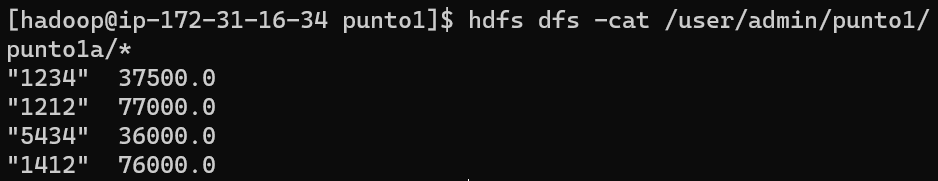
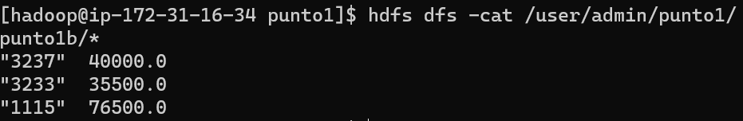

# Reto de programación en Map/Reduce

Debido a que en estos retos nos pedían que estos se resolvieran en el EMR, debemos clonar este repo

```
git clone https://github.com/jjsanchezc/TopicosEnTelematica.git
cd TopicosEnTelematica/Laboratorios/Lab6/RetoProgramacion
```
Luego de entrar al `RetoProgramacion` podemos ver que está separado en cada punto que se pedia, y dentro de estos puntos se encuentran sus respectivas datasets.txt

## Punto1

Se tiene un conjunto de datos, que representan el salario anual de los empleados formales en Colombia por sector económico, según la DIAN. ver su [dataset.txt](RetoProgramacion/punto1/dataset.txt) <br>

crear las carpetas en el hdfs:

```
hdfs dfs -mkdir /user/admin/punto1/
hdfs dfs -mkdir /user/admin/punto2/
hdfs dfs -mkdir /user/admin/punto3/
```

### Punto1a
El salario promedio por Sector Económico (SE) <br>
si desea ver el [codigo](RetoProgramacion/punto1/punto1a.py) <br>

para copiar el dataset 

```
cd punto1
hdfs dfs -put dataset.txt hdfs:///user/admin/punto1/dataset.txt
```

se ejecuta el comando:

```
python punto1a.py hdfs:///user/admin/punto1/dataset.txt -r hadoop --output-dir hdfs:///user/admin/punto1/punto1a
```

y su resultado es:



para poder ver el resultado hay que ejecutar el comando:

```
hdfs dfs -cat /user/admin/punto1/punto1a/*
```

***

### Punto1b
El salario promedio por Empleado <br>
si desea ver el [codigo](RetoProgramacion/punto1/punto1b.py) <br>
se ejecuta el comando:

```
python punto1b.py hdfs:///user/admin/punto1/dataset.txt -r hadoop --output-dir hdfs:///user/admin/punto1/punto1b
```

y su resultado es:



***

para poder ver el resultado hay que ejecutar el comando:

```
hdfs dfs -cat /user/admin/punto1/punto1b/*
```

### Punto1c
Número de SE por Empleado que ha tenido a lo largo de la estadística <br>
si desea ver el [codigo](RetoProgramacion/punto1/punto1c.py) <br>
se ejecuta el comando:

```
python punto1c.py hdfs:///user/admin/punto1/dataset.txt -r hadoop --output-dir hdfs:///user/admin/punto1/punto1c
```

y su resultado es:


***

para poder ver el resultado hay que ejecutar el comando:

```
hdfs dfs -cat /user/admin/punto1/punto1c/*
```

# Punto2

Se tiene un conjunto de acciones de la bolsa, en la cual se reporta a diario el valor promedio por acción, la estructura de los datos es [dataset.txt](RetoProgramacion/punto2/dataset.txt) <br>

para copiar el dataset 

```
cd ../punto2
hdfs dfs -put dataset.txt hdfs:///user/admin/punto2/dataset.txt
```

### Punto2a
Por acción, dia-menor-valor, día-mayor-valor <br>
si desea ver el [codigo](RetoProgramacion/punto2/punto2a.py) <br>
se ejecuta el comando:

```
python punto2a.py hdfs:///user/admin/punto2/dataset.txt -r hadoop --output-dir hdfs:///user/admin/punto2/punto2a
```

y su resultado es:


***

para poder ver el resultado hay que ejecutar el comando:

```
hdfs dfs -cat /user/admin/punto2/punto2a/*
```
### Punto2b
Listado de acciones que siempre han subido o se mantienen estables <br>
si desea ver el [codigo](RetoProgramacion/punto2/punto2b.py) <br>
se ejecuta el comando:

```
python punto2b.py hdfs:///user/admin/punto2/dataset.txt -r hadoop --output-dir hdfs:///user/admin/punto2/punto2b
```

y su resultado es:


***

para poder ver el resultado hay que ejecutar el comando:

```
hdfs dfs -cat /user/admin/punto2/punto2b/*
```
### Punto2c
DIA NEGRO: Saque el día en el que la mayor cantidad de acciones tienen el menor valor de acción (DESPLOME), suponga una inflación independiente del tiempo. <br>
si desea ver el [codigo](RetoProgramacion/punto2/punto2c.py) <br>
se ejecuta el comando:

```
python punto2c.py hdfs:///user/admin/punto2/dataset.txt -r hadoop --output-dir hdfs:///user/admin/punto2/punto2c
```

y su resultado es:


***

para poder ver el resultado hay que ejecutar el comando:

```
hdfs dfs -cat /user/admin/punto2/punto2c/*
```
# Punto3
Sistema de evaluación de películas: Se tiene un conjunto de datos en el cual se evalúan las películas con un rating. Ver su [dataset.txt](RetoProgramacion/punto3/dataset.txt) <br>

para copiar el dataset 

```
cd ../punto3
hdfs dfs -put dataset.txt hdfs:///user/admin/punto3/dataset.txt
```

### Punto3a
Número de películas vista por un usuario, valor promedio de calificación (SE) <br>
si desea ver el [codigo](RetoProgramacion/punto3/punto3a.py) <br>
se ejecuta el comando:

```
python punto3a.py hdfs:///user/admin/punto3/dataset.txt -r hadoop --output-dir hdfs:///user/admin/punto3/punto3a
```

y su resultado es:


***

para poder ver el resultado hay que ejecutar el comando:

```
hdfs dfs -cat /user/admin/punto3/punto3a/*
```
### Punto3b
Día en que más películas se han visto <br>
si desea ver el [codigo](RetoProgramacion/punto3/punto3b.py) <br>
se ejecuta el comando:

```
python punto3b.py hdfs:///user/admin/punto3/dataset.txt -r hadoop --output-dir hdfs:///user/admin/punto3/punto3b
```

y su resultado es:


para poder ver el resultado hay que ejecutar el comando:

```
hdfs dfs -cat /user/admin/punto3/punto3b/*
```

***

### Punto3c
Día en que menos películas se han visto <br>
si desea ver el [codigo](RetoProgramacion/punto3/punto3c.py) <br>
se ejecuta el comando:

```
python punto3c.py hdfs:///user/admin/punto3/dataset.txt -r hadoop --output-dir hdfs:///user/admin/punto3/punto3c
```

y su resultado es:


para poder ver el resultado hay que ejecutar el comando:

```
hdfs dfs -cat /user/admin/punto3/punto3c/*
```

***

### Punto3d
Número de usuarios que ven una misma película y el rating promedio <br>
si desea ver el [codigo](RetoProgramacion/punto3/punto3d.py) <br>
se ejecuta el comando:

```
python punto3d.py hdfs:///user/admin/punto3/dataset.txt -r hadoop --output-dir hdfs:///user/admin/punto3/punto3d
```

y su resultado es:


para poder ver el resultado hay que ejecutar el comando:

```
hdfs dfs -cat /user/admin/punto3/punto3d/*
```

***

### Punto3e
Día en que peor evaluación en promedio han dado los usuarios <br>
si desea ver el [codigo](RetoProgramacion/punto3/punto3e.py) <br>
se ejecuta el comando:

```
python punto3e.py hdfs:///user/admin/punto3/dataset.txt -r hadoop --output-dir hdfs:///user/admin/punto3/punto3e
```

y su resultado es:


para poder ver el resultado hay que ejecutar el comando:

```
hdfs dfs -cat /user/admin/punto3/punto3e/*
```

***

### Punto3f
Día en que mejor evaluación han dado los usuarios <br>
si desea ver el [codigo](RetoProgramacion/punto3/punto3f.py) <br>
se ejecuta el comando:

```
python punto3f.py hdfs:///user/admin/punto3/dataset.txt -r hadoop --output-dir hdfs:///user/admin/punto3/punto3f
```

y su resultado es:


para poder ver el resultado hay que ejecutar el comando:

```
hdfs dfs -cat /user/admin/punto3/punto3f/*
```

***

### Punto3g
La mejor y peor película evaluada por genero <br>
si desea ver el [codigo](RetoProgramacion/punto3/punto3g.py) <br>
se ejecuta el comando:

```
python punto3g.py hdfs:///user/admin/punto3/dataset.txt -r hadoop --output-dir hdfs:///user/admin/punto3/punto3g
```

y su resultado es:


para poder ver el resultado hay que ejecutar el comando:

```
hdfs dfs -cat /user/admin/punto3/punto3g/*
```

***

[Volver](../README.md)