# **RetoProgramación N1**
**Curso:** Tópicos Especiales en Telemática <br>
**Título:** Comunicación entre Procesos Remotos: gRPC.<br>
**Autores:** Juan José Sánchez Cortés - Estudiante de la Universidad EAFIT - [jjsanchezc](https://gist.github.com/jjsanchezc) <br>

***

**Tabla de Contenido**

1. [Introducción](#Introduccion)
2. [Estrucutra](#Estructura)
3. [Resultados](#Resultados)
4. [Desarrollo](#Desarrollo) 
5. [Despliegue](#Despliegue) <br>

***

<div id='Introduccion'/>

## **1. Descripción y alcance del proyecto.**
 Este reto tiene como fin, poder aplicar gRPC mediante el uso de una API Gateway y dos microservicios. Esta API debe recibir request desde postman, y poder procesar el pedido para poderle dar una respuesta al cliente. <br>
 El uso de microservicios fue fundamental para este trabajo porque cada uno tiene sus propias funcionalidades y tienen que ser independiente, pero a la vez, con el uso de gRPC, estas deben ser capaces de pedirle cosas al otro microservicio. La comunicación entre estos debia realizarse mediente protocol buffers

***

 <div id='Estructura'/>

## **2. Estructura del Proyecto.**
Este proyecto está dividido en 3 partes:
- APIs (Python)
- Inventory (Go)
- ShoppingCart (Python)
### **APIs**
Dentro de esta carpeta hay un entorno virtual de python, nosotros solo nos enfocaremos en las carpetas llamadas "protobufs" y "src".
- protobufs:
   - Son los archivos .proto que usamos para conectar el API-Gateway con los microservicios
- src:
   - Se encuentra principalmente el servidor donde corre el API y todo el codigo gRPC que se generan de los .proto

### **Inventory**
En la carpeta de Inventory podemos encontrar un cambio de lenguaje (pasamos de Python a GoLang), por lo tanto tendremos carpetas nuevas, como lo son "go.mod" (tiene todas las librerias que se usan) y "go.sum" (describe la versión exacta que el compilador usará, haciendo que dicha compilación, sea fácil de reproducir).
Pero las carpetas principales son "ProductAvailability" y "src"
- ProductAvailability:
   - Se encuentra el archivo .proto y el codigo gRPC (en Go) que se generan de los .proto

- src:
   - Servidor del inventario y todos los procesos lógicos del inventario

### **ShoppingCart**
Hay un entorno virtual donde dentro de este se encuentran las respectivas carpetas. Pero al igual que en la carpeta de la API,solo nos enfocaremos en las carpetas "protobufs" y "src".
- protobufs:
   - Son los archivos .proto que usamos para conectar el API-Gateway con los microservicios
- src:
   - Se encuentra principalmente el servidor donde corre el API y todo el codigo gRPC (en Python) que se generan de los .proto

## Arquitectura
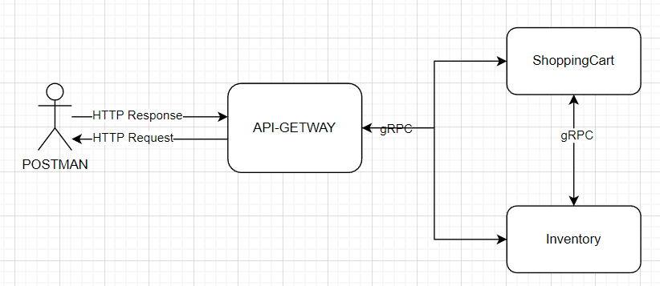<br>
Para este programa se realizo una simulación de una parte de un comercio electronico con API Gateway que gestiona las peticiones HTTP entrantres y las reenvía a los microservicios. En algunos metodos como AddProduct, podemos ver la interacción entre microservicios, ya que para poder agregar un producto al carrito de compras, primero debe revisar si hay stock disponible en el inventario.
Hay otros microservicios que simplemente dependen de que el api reciba una solicitud, le pregunte al microservico, este le responda y ya el api le de la respuesta final al postman (en este caso podriamos ver a DeleteProduct en el microservicio de ShoppingCart y SearchProduct en el microservicio de inventory)<br>
***
<div id='Resultados'/>

## Resultados logrados
   Al final del dia se logró implementar de forma correcta los microservicios y la api, se logró un resultado muy basico pero funcional. Ya que lo principal era hacer la conexión, la implementeación de los metodos de cada microservicio no están muy detallados. La api recibe request del postman y dependiendo del producto que pidiese, le daba una repuesta predeteminada (ya que no se tenian bases de datos para poder hacer la relación real).<br>
   Algo importante es que se intentó usar algunas funciones del proto3 pero que al momento de implementarlo fue de una forma muy rustica (pero funcional), ejemplo de esto es en el .proto de shopping_cart_service en la carpeta APIs, se intentó implementar un campo opcional en los mensajes pero al momento de invocarlo en el servidor no sabia como implementar ese optional y me tocó hacer un if else para poder que me funcionara.<br>

***

<div id='Desarrollo'/>

## Descripción técnica de la solución implementada: 


En esta parte vamos a ir de carpeta en carpeta, primero con las dos de python api y shoppingcart
<div id='APIs'/>

### ***APIs***
Vamos a entrar en la libreria, dentro de la libreria tenemos dos formas poder usar el codigo, una de ellas es activando el entorno virutual, y  la otra es instalando los requerimientos necesarios en nuestra consola<br>
Si decidimos la primera opción, vamos a ejecutar el siguiente codigo en consola (Windows)
```
.\Scripts\activate
```
Si quieres la segunda opción, entonces ejecutar el siguiente codigo:
```
pip install requirements.txt
```

El puerto que utiliza el servidor de APIs es el 5000<br>
Para poder correr el codigo simplemente vamos a poner en consola 
```
python src\server.py
```
***Nota***: recuerda que para poder usar los comando debes estar en la ubicación "Back\APIs"

<div id='ShoppingCart'/>

### ***ShoppingCart***
Vamos a entrar en la libreria, dentro de la libreria tenemos dos formas poder usar el codigo, una de ellas es activando el entorno virutual, y  la otra es instalando los requerimientos necesarios en nuestra consola<br>
Si decidimos la primera opción, vamos a ejecutar el siguiente codigo en consola (Windows)
```
.\Scripts\activate
```
Si quieres la segunda opción, entonces ejecutar el siguiente codigo:
```
pip install requirements.txt
```

El puerto que utiliza el servidor de APIs es el 50052<br>
Para poder correr el codigo simplemente vamos a poner en consola 
```
python src\shopping_cart_server.py
```
***Nota***: recuerda que para poder usar los comando debes estar en la ubicación "Back\ShoppingCart"

<div id='Inventory'/>

### ***Inventory***
Antes que nada debemos tener la version 1.16 para poder instalar dale click [aca](https://go.dev/doc/install). <br>
Despues de haber instalado,vamos a iniciar el servidor de inventario, para esto, tenemos que realizar el siguiente comando: 
```
go run src\inventory_server.py
```
***Nota:*** Todas las librerias que se usaron van a estar en \Back\Inventory\go.mod

***

<div id='Despliegue'/>

## Guía de uso
Para poder usar de forma correcta el programa primero debemos inicializar en 3 consolas diferentes los 2 servidores de los microservicios y el servidor del api-gateway.<br>
### ***Inicializar servidores***:
***Api-gateway:*** Para inicializar el servidor debemos estar en la carpeta Back/APIs,[definir](#APIs). Ya que iniciamos el servidor este estará esperando el request.<br>
Deberia verse así:<br>
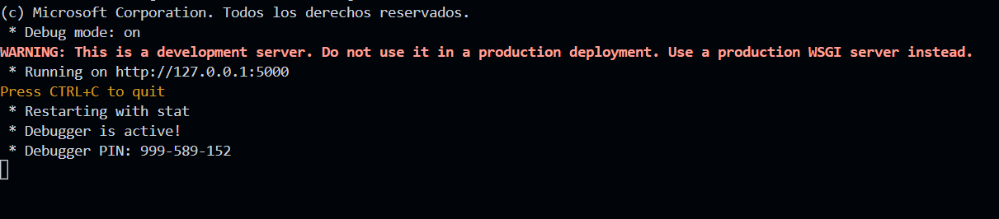<br>
***ShoppingCart:*** Para inicializar el servidor debemos estar en la carpeta Back/ShoppingCart,[definir](#ShoppingCart). luego de iniciar el servidor este estará esperando a las peticiones del api.<br>
Deberia verse así:<br>
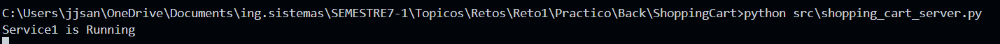<br>
***Inventory:*** Para inicializar el servidor debemos estar en la carpeta Back/Inventory,[definir](#Inventory). luego de iniciar el servidor este estará esperando a las peticiones del api.<br>
Deberia verse así:<br>
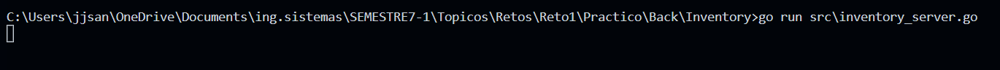<br>
### ***Configurar Postman***
Postman es el servicio que se usó para poder conectarse con el programa. Para poder empezar a hacer peticiones primero tenemos que crear un HTTP request:
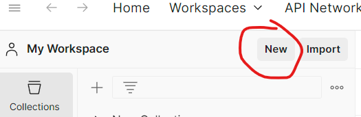<br>
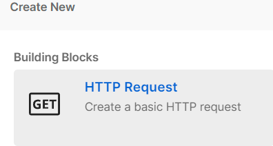<br>
Luego debemos de definir la url y el metodo
***definir url:*** 
```
localhost:5000/ < microservicio > / < accion a realizar >
```
- tipos de microservicio: 
   - ShoppingCartService<br>
      Accion: (Usan metodo POST)
      - AddProduct
      - DeleteProduct
   - ProductToSearch<br>
      Accion: (Usan metodo POST)
      - Availability

Despues tenemos definir el mensaje que le vamos a enviar al api para poder obtener una respuesta, en este caso vamos a usar el siguiente ejemplo :<br>
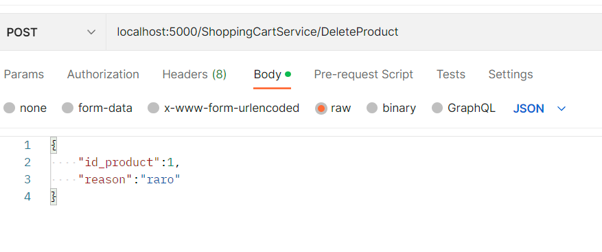<br>
Podemos ver como definimos que es un POST, luego le dimos la URL, despues definimos el mensaje, en este caso le vamos a enviar un json con los parametros que se ven
Para terminar le damos en el boton de SEND y abajo deberia aparecernos la respuesta del servidor<br>
Imagenes de posibles respuestas:<br>
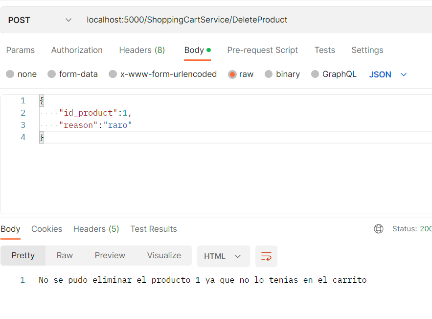<br>
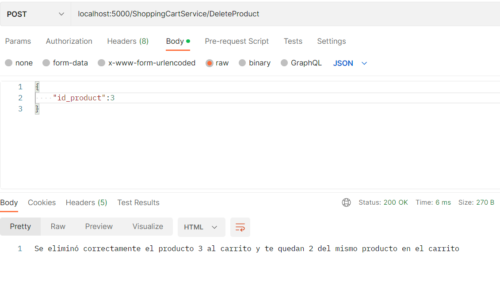<br>
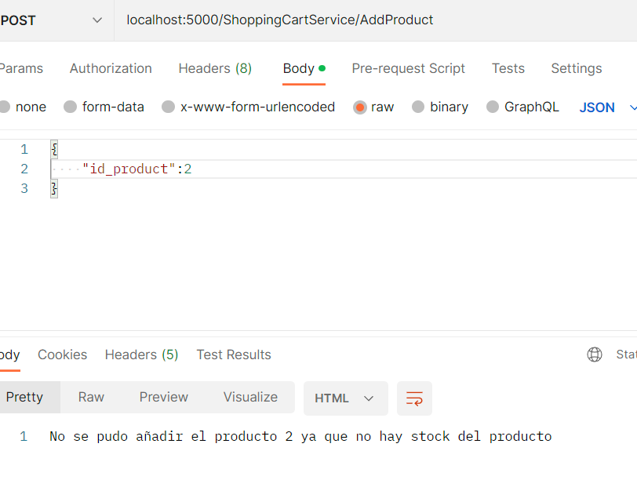<br>
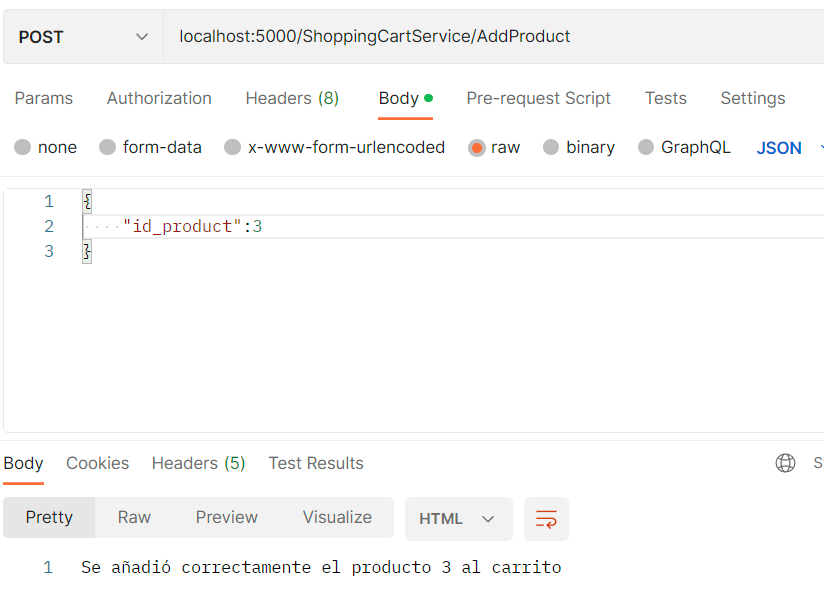<br>
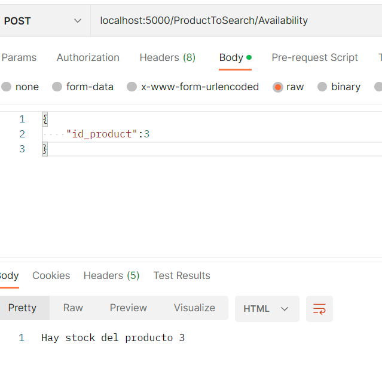<br>
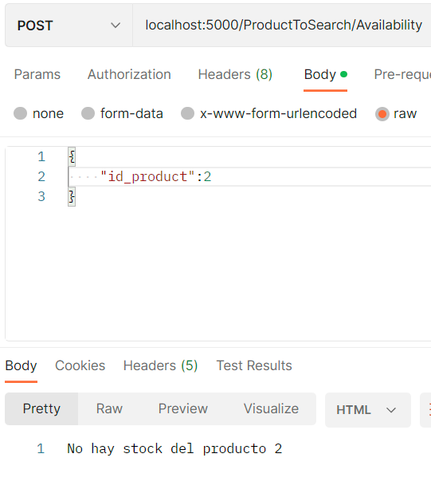<br>

