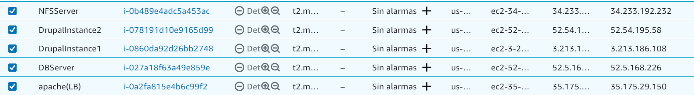
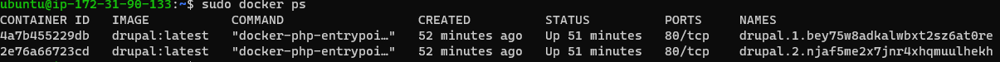
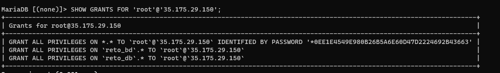
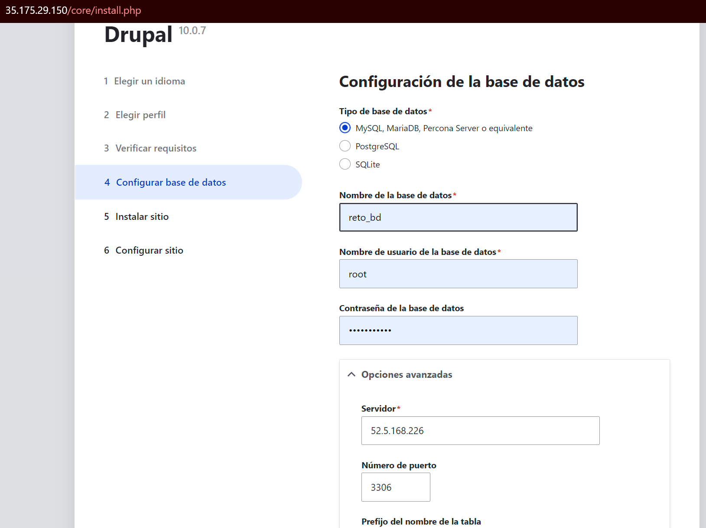
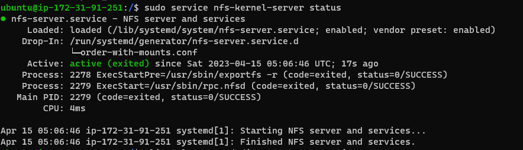

# **Reto 3**
**Curso:** Tópicos Especiales en Telemática <br>
**Título:** Aplicación Monolítica con Balanceo y Datos Distribuidos.<br>
**Autores:** Juan José Sánchez Cortés - Estudiante de la Universidad EAFIT - [jjsanchezc](https://gist.github.com/jjsanchezc) <br>

***

**Tabla de Contenido**

1. [Introducción](#Introduccion)
2. [Estrucutra](#Estructura)
3. [AWS](#AWS)
4. [LoadBalancer](#LoadBalancer) 
5. [Drupal](#Drupal)
6. [MariaDB](#MariaDB)
7. [NFS](#NFS)
<br>

***

<div id='Introduccion'/>

## **1. Introducción**

Este reto se realiza con el fin de poder crear un CMS usando drupal, AWS, Docker, Mariadb, NFS, 

***

<div id='Estructura'/>

## **2. Estructura**
Para la estructura de este reto se creron 5 instancias en AWS EC2,

- 1 instancia para el balanceador de cargas
- 2 instancias para el drupal
- 1 instancia para la base de datos
- 1 instancia para el NFS

 

- Balanceador de cargas Apache IP-pub:35.175.29.150
- Drupal 1 IP-pub: 3.213.186.108
- Drupal 2 IP-pub: 52.54.195.58
- MariaDB IP-pub: 52.5.168.226
- NFS IP-pub: 34.233.192.232
***

<div id='AWS'/

## **3. AWS**
En el AWS se crearon las insancias y se les dió una ip elastica


***

<div id='LoadBalancer'/>

## **4. LoadBalancer**
Promero se configura la imagen de Docker para Drupal:
```
# Utiliza una imagen base de PHP y Apache
FROM php:7.4-apache

# Copia los archivos de Drupal a la imagen
COPY . /var/www/html

# Instala las dependencias de PHP y Apache
RUN apt-get update && apt-get install -y \
    libpng-dev \
    libjpeg-dev \
    libpq-dev \
    && docker-php-ext-install -j$(nproc) \
    gd \
    opcache \
    pdo \
    pdo_mysql \
    pdo_pgsql

# Configura el sitio de Drupal en Apache
RUN chown -R www-data:www-data /var/www/html
RUN a2enmod rewrite

```

Se construye y publica la imagen que se creó
```
docker build -t drupal
```

se crean las 2 replicas para el cluster de docker swarm
```
docker service create --name drupal --replicas 2 -p 80:80 drupal
```

el resultado es:


Para el load balancer se usó apache, luego de instalar apache en la vm de loadbalancer, se modificó una linea del archivo apache.conf.

Para abrir el archivo apache.conf:
```
sudo nano apache.conf
```

el archivo queda de la sigueinte forma:

```
<VirtualHost *:80>
  ProxyPreserveHost On
  ProxyPass / http://<3.213.186.108>/
  ProxyPassReverse / http://<3.213.186.108>/
  ProxyPass / http://<52.54.195.58>/
  ProxyPassReverse / http://<52.54.195.58>/
</VirtualHost>
```
***

<div id='Drupal'/>

## **5. Drupal**
Para hacer lo de Drupal, se instaló docker para despues ejecutar el siguiente codigo, en el cual podemos ver a donde va a buscar a la base de datos para darle los permisos para el CRUD, y tambien podemos ver a donde llama para hacer el NFS
```
sudo docker run -d --name drupal1 -e DRUPAL_DATABASE_HOST=52.5.168.226 -e DRUPAL_DATABASE_USER=root@3.213.186.108 -e DRUPAL_DATABASE_PASSWORD=jjsanchezc -e DRUPAL_DATABASE_NAME=reto_
db -e DRUPAL_FILES_PATH=/mnt/nfs -e DRUPAL_FILES_NFS_SERVER=34.233.192.232 -e DRUPAL_FILES_NFS_PATH=/exports -d drupal
```
***

<div id='MariaDB'/>

## **6. MariaDB**
Al igual que el resto de instancias, se tuvo que instalar primero docker, para despues poder crear una imagen para la base de datos de mariadb.

El siguiente comando se usó para poder traer de docker hub la imagen de mariadb (nota: contraseña se cambio por otra diferente) la base de datos usará el puerto 3306 del sistema
```
docker run -d --name mariadb -e MYSQL_ROOT_PASSWORD=contraseña -p 3306:3306 mariadb
```
luego se iniciaba la base de datos con el siguiente comando 
```
sudo mysql -h 52.5.168.226 -P 3306 -u root -p
```
despues de ingresar a la base de datos se le daban los permisos necesarios a los usuarios para poder realizar cambios a la base de datos desde otra instancia y desde drupal, despues de dar los permisos, la base queda asi (ejemplo solo con el drupal1)<br>

<br>
para ver si funciona, se inició e ingresó la ip del balanceador de cargas



***

<div id='NFS'/>

## **7. NFS**
Primero hay que instalar el nfs-kernel-server:
```
  sudo apt-get install nfs-kernel-server
```
despues se crea un directorio en la instancia que se utilizará como punto de montaje para el sistema de archivos que será compartido a través de NFS
```
sudo mkdir /nfs_server
```
Se configura el archivo /etc/exports para especificar los directorios que se compartirán a través de NFS
```
 sudo nano /etc/exports
```
y luego se edita una linea para que el codigo quede asi:
```
/nfs_server *(rw,sync,no_subtree_check)
```
Se reinicia el nfs-kernel-server:
```
sudo service nfs-kernel-server restart
```
se configura los permisos adecuados en el directorio que se compartió a través de NFS:
```
 sudo chown nobody:nogroup /nfs_server
sudo chmod 777 /nfs_server
```
Para terminar, si se quiere saber si se implementó bien hay que hacer el siguiente comando:
```
sudo service nfs-kernel-server status
```
para que acabe saliendo algo asi:<br>

***